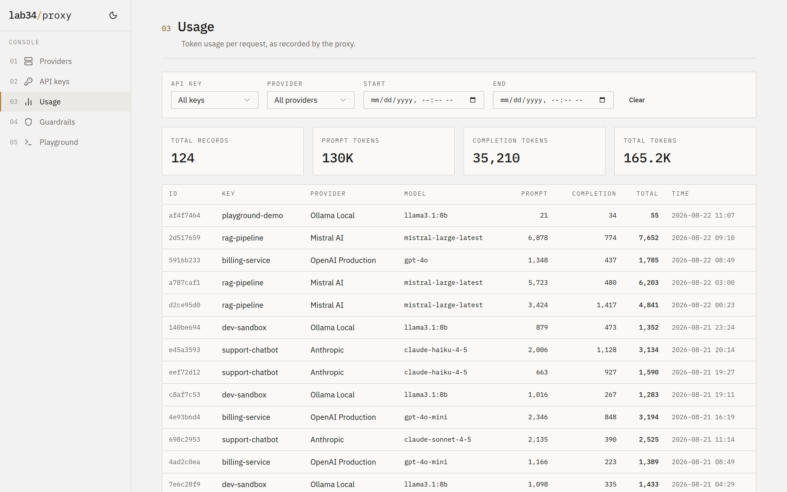
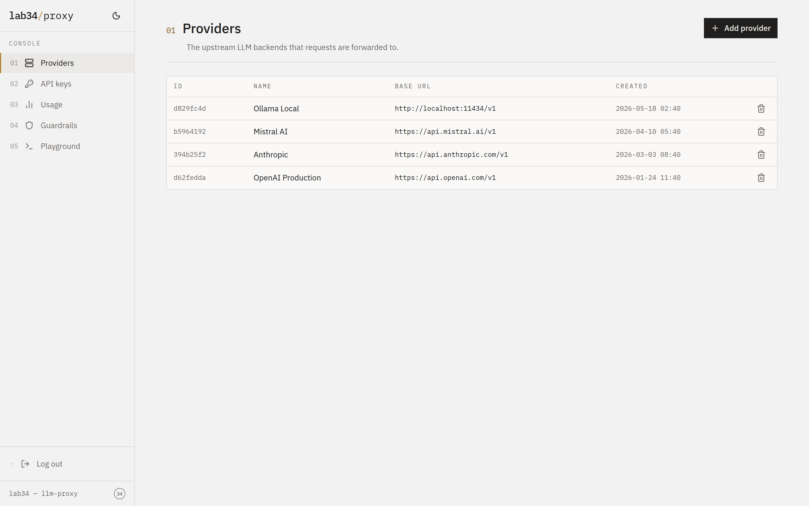
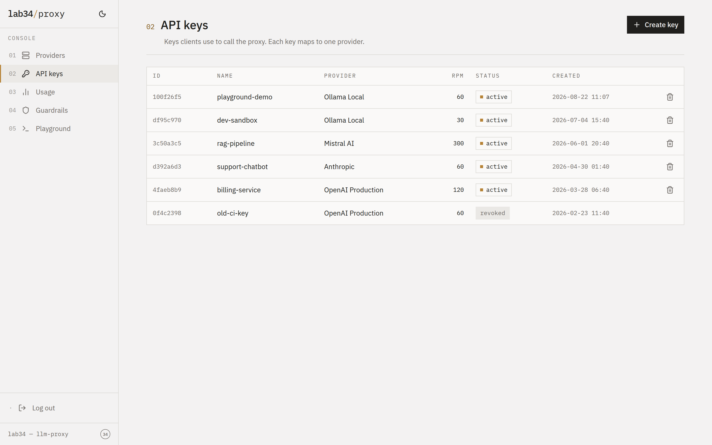
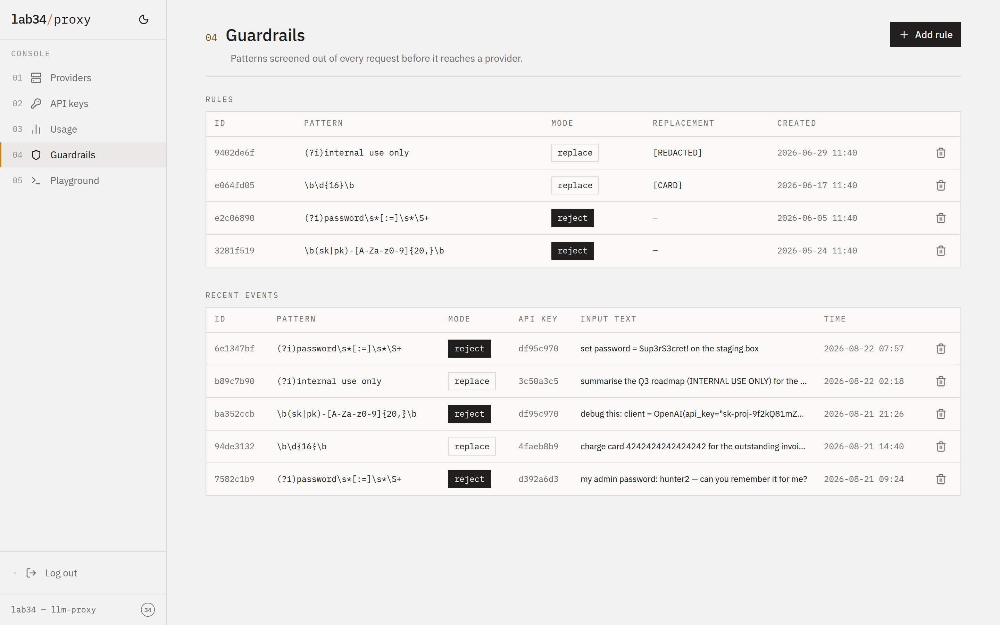

# LLM Proxy

An OpenAI-compatible LLM proxy that routes requests to any OpenAI-compatible backend. Written in Go. SQLite for storage.

## Features

- **OpenAI-compatible API** -- drop-in replacement for any OpenAI client library
- **Streaming (SSE)** -- full support for streamed chat completions
- **Multi-provider management** -- register any number of upstream backends
- **Proxy API key issuance** -- `llmp-` prefixed keys so clients never see upstream credentials
- **Per-key rate limiting** -- configurable requests-per-minute limits
- **Token usage tracking** -- records prompt, completion, and total tokens per request
- **Swagger UI** -- interactive API documentation at `/docs`
- **OpenAPI 3.1 spec** -- source of truth, embedded in the binary
- **Dashboard** -- web UI for monitoring usage and managing resources
- **Guardrails** -- configurable safety rules to change or reject LLM interactions

## Screenshots

<table>
  <tr>
    <td align="center"><strong>Usage</strong><br/><a href="docs/screenshots/usage.png"></a><br/>Token usage stats and request metrics</td>
    <td align="center"><strong>Providers</strong><br/><a href="docs/screenshots/providers.png"></a><br/>Upstream LLM backend configuration</td>
    <td align="center"><strong>API Keys</strong><br/><a href="docs/screenshots/api_keys.png"></a><br/>API key issuance and management</td>
  </tr>
  <tr>
    <td align="center"><strong>Guardrails</strong><br/><a href="docs/screenshots/guardrails.png"></a><br/>Safety rules and content filtering</td>
    <td></td>
    <td></td>
  </tr>
</table>

## Quick start

```bash
# Build
go build -o llm-proxy .

# Run (ADMIN_TOKEN is required)
ADMIN_TOKEN=my-secret-admin-token ./llm-proxy
```

The server starts on `:8080` by default. Open http://localhost:8080/docs for the Swagger UI. The dashboard is available at http://localhost:8080/dashboard.

## Configuration

All configuration is via environment variables:

| Variable | Default | Description |
|---|---|---|
| `ADDR` | `:8080` | Server listen address |
| `DSN` | `llm-proxy.db` | SQLite database file path |
| `ADMIN_TOKEN` | *(required)* | Bearer token for `/admin/*` endpoints and dashboard login |

## Development

Run both the Go backend and the React (Vite) frontend in a single command:

```bash
./development.sh
```

This starts the Go backend on `:8080` and the Vite dev server on `:5173` with hot reload. The dashboard is available at http://localhost:5173/dashboard.

The `ADMIN_TOKEN` defaults to `admin` in development. Override it with:

```bash
ADMIN_TOKEN=my-secret ./development.sh
```

**Prerequisites:** Go 1.25+, Node.js 22+.

### Production build

```bash
cd internal/web/frontend && npm ci && npm run build && cd -
go build -trimpath -ldflags="-s -w" -o llm-proxy .
```

This produces a single binary with the React dashboard embedded.

## Project structure

```
llm-proxy/
├── openapi.yaml                    # OpenAPI 3.1 spec (embedded at compile time)
├── main.go                         # Entrypoint
├── development.sh                  # Start frontend + backend for local dev
├── Dockerfile                      # Multi-stage build (Node + Go)
├── docker-compose.yml              # Local dev / deployment
└── internal/
    ├── config/config.go            # Environment-based configuration
    ├── db/
    │   ├── db.go                   # SQLite connection (WAL mode)
    │   └── migrations.go           # Auto-migrating schema
    ├── models/models.go            # Domain types
    ├── store/
    │   ├── provider.go             # Provider CRUD
    │   ├── apikey.go               # API key create/lookup/revoke
    │   ├── usage.go                # Usage recording and queries
    │   ├── guardrail.go            # Guardrail rule CRUD
    │   └── guardrail_event.go      # Guardrail event logging
    ├── middleware/
    │   ├── auth.go                 # Admin + proxy key authentication
    │   └── ratelimit.go            # Per-key rate limiting
    ├── handler/
    │   ├── admin.go                # Admin API handlers
    │   ├── proxy.go                # Proxy API handlers
    │   └── docs.go                 # Swagger UI + spec serving
    ├── proxy/forwarder.go          # Upstream request forwarding + guardrail enforcement
    └── web/
        ├── spa.go                  # SPA handler (embeds frontend/dist/)
        └── frontend/               # React app (Vite + TypeScript + Tailwind + shadcn/ui)
            ├── src/
            │   ├── api/client.ts   # API client for /admin/* endpoints
            │   ├── context/        # Auth context (localStorage token)
            │   ├── components/     # Layout, brand marks, shadcn/ui primitives
            │   └── pages/          # Providers, Keys, Usage, Guardrails, Playground
            ├── vite.config.ts
            └── package.json
```

## Benchmarks

Benchmarks run against a realistic environment with **100 providers**, **100 API keys**, and **100 guardrail rules** loaded in the database. The mock upstream responds instantly, so results isolate proxy overhead.

```bash
go test -bench=. -benchmem -benchtime=3s ./internal/proxy/ -run='^$'
```

Results on Apple M3 Max (arm64):

| Benchmark | ns/op | B/op | allocs/op |
|---|--:|--:|--:|
| ForwardChatCompletion_NonStreaming | 484,511 | 517,372 | 3,894 |
| ForwardChatCompletion_Streaming | 538,411 | 574,631 | 3,888 |
| APIKeyLookup | 7,806 | 1,576 | 43 |
| GuardrailEvaluation | 480,464 | 461,046 | 3,659 |
| UsageRecording | 23,312 | 720 | 17 |
| AdminListProviders | 251,850 | 133,757 | 2,447 |

**Key takeaways:**

- **API key lookup** (SHA-256 hash + SQLite query among 100 keys) completes in ~8 us.
- **Usage recording** (SQLite INSERT) takes ~23 us per request.
- **Guardrail evaluation** with 100 compiled regex patterns is the dominant cost in the proxy path (~480 us). This cost is per-request since patterns are compiled on each evaluation.
- **Full chat completion** round-trip (parse, guardrails, upstream call, response copy, usage write) stays under 0.5 ms for non-streaming and 0.54 ms for streaming, excluding actual upstream latency.

## License

MIT -- see [LICENSE](LICENSE).
